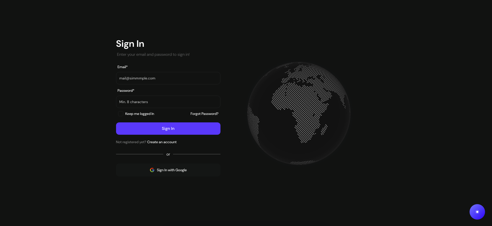
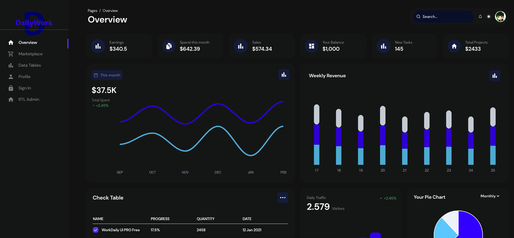

# [WorkDaily UI TailwindCSS React Typescript ⚡️](https://chrisw.vercel.app/projects/react)

Get started and build your dream web app with WorkDaily UI, the trendiest & innovative Open Source Admin Template for Tailwind CSS & React!

---

### Introduction

Designed for those who like modern UI elements and beautiful websites. Made of hundred of elements, designed blocks and fully coded pages, WorkDaily UI is ready to help you create stunning websites and webapps.

Save hundreds of hours trying to create and develop a dashboard from scratch.
The fastest, most responsive & trendiest dashboard for Tailwind CSS is here. Seriously.

Authentication Pages, Profile and so on. Just choose between a Basic Design or a cover and you are good to go!

### 🎉 [NEW] WorkDaily UI Components

All the main components from both versions, this will help you to see and interact with all & the latest added components of WorkDaily (also, new components are on the way, stay tuned)! ⚡️
<a href="https://chrisw.vercel.app/projects/react/components" target="_blank">See all components</a>

### Documentation

Each element is well presented in a very complex documentation. You can read more about the <a href="https://chrisw.vercel.app/projects/react/installation" target="_blank">documentation here.</a>

#### Login Pages

- Dark Mode:

- Light Mode:


#### Dashboard Pages

- Dark Mode:

- Light Mode:


### Quick Start

Install WorkDaily UI by running either of the following:

- Install NodeJS LTS from [NodeJs Official Page](https://nodejs.org/en) (NOTE: Product only works with LTS version).

Clone the repository with the following command:

```bash
git clone https://github.com/itwebtiger/workdaily-tailwind-react-ts.git
```

Run in terminal this command:

```bash
npm install
```

Then run this command to start your local server

```bash
npm start
```
